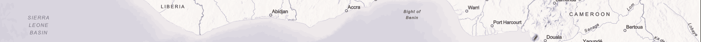

<!-- <hr> -->
<!-- # ```{r setup, include=FALSE} -->
<!-- # knitr::opts_chunk$set(echo = FALSE) -->
<!-- # library(gridExtra) -->
<!-- # library(knitr) -->
<!-- # ``` -->


<hr>
{ width=200% height=50% }
<hr>
## **1.0 Ms.c Thesis ** 

### Report and Charts


<hr>